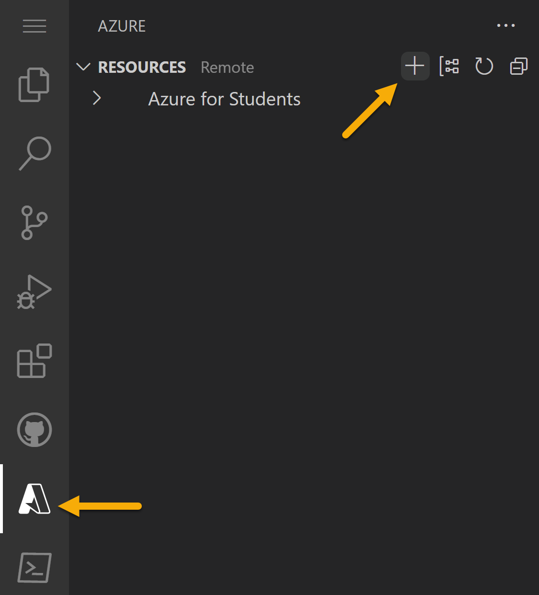
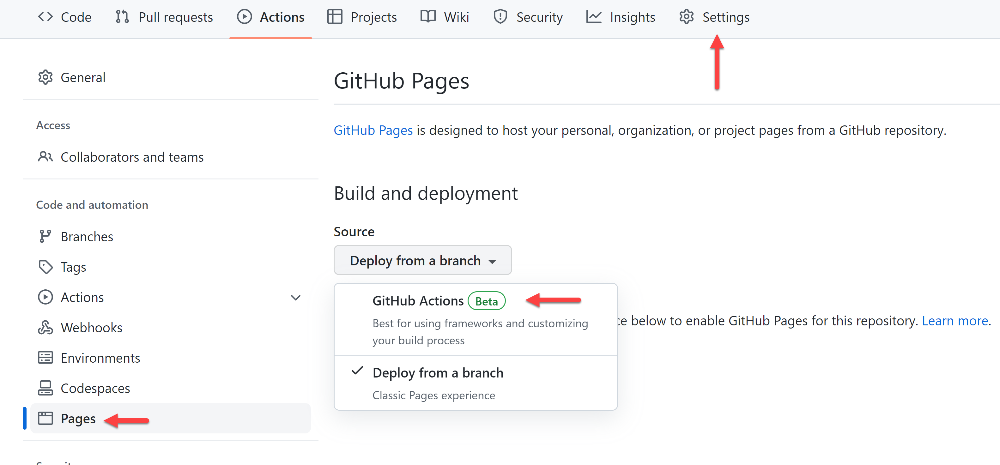
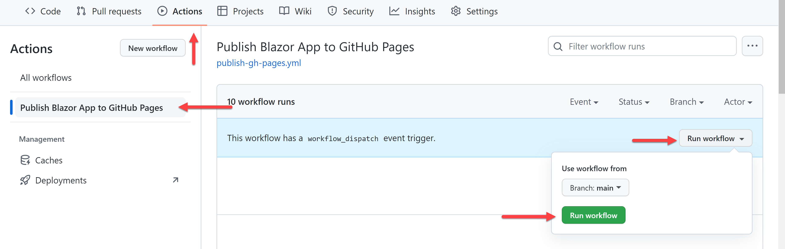
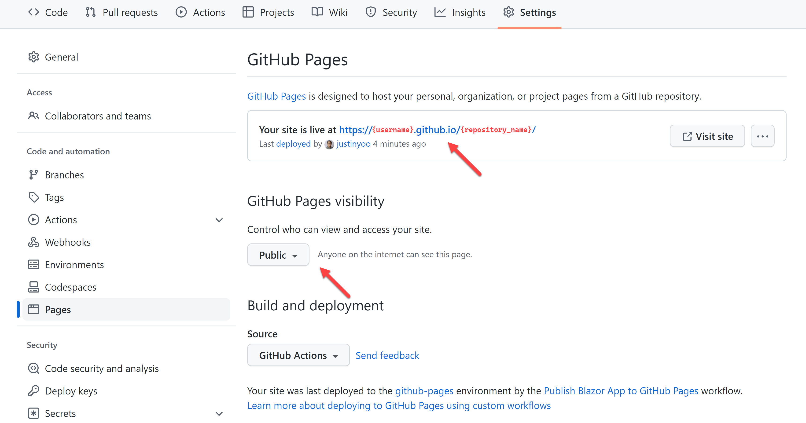
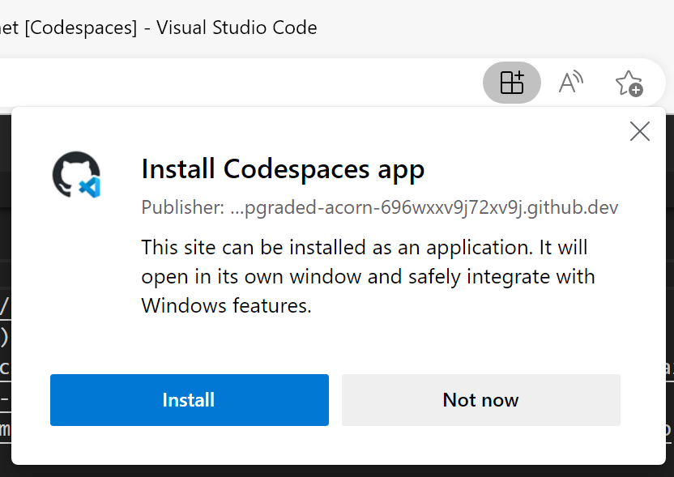

# .NET (Blazor) Portfolio Site with GitHub Codespaces

## 🏃 Deploy your web application

Project includes the setup needed for you to deploy **free** to both [Azure Static Web Apps](https://azure.microsoft.com/products/app-service/static/?WT.mc_id=dotnet-82024-juyoo) and [GitHub Pages](https://pages.github.com/)</a>.

### Azure Static Web Apps

[Azure Static Web Apps](https://azure.microsoft.com/products/app-service/static/?WT.mc_id=dotnet-82024-juyoo) is Microsoft's hosting solution for static sites (or sites that are rendered in the user's browser, not on a server) through Azure. This service provides additional opportunities to expand your site through Azure Functions, authentication, staging versions and more.

You'll need both Azure and GitHub accounts to deploy your web application. If you don't yet have an Azure account you can create it from within during the deploy process, or from below links:

* [Create a (no Credit Card required) Azure For Students account](https://azure.microsoft.com/free/students/?WT.mc_id=dotnet-82024-juyoo)
* [Create a new Azure account](https://azure.microsoft.com/free/?WT.mc_id=dotnet-82024-juyoo)

With your project open in Codespaces:

1. Click Azure icon in the left sidebar. Log in if you are not already, and if new to Azure, follow the prompts to create your account.
1. From Azure menu click "➕" sign and then choose "Create Static Web App".

   

1. If you are not logged into GitHub you will be prompted to log in. If you have any pending file changes you will then be prompted to commit those changes.
1. Set you application information when prompted:
    1. **Name for Static Web App**: enter the name for the Static Web App. Default to your GitHub repository name.
    1. **Region**: pick the one closest to your region
    1. **Project structure**: select "Blazor"
    1. **Location of application code**: enter `/src/BlazorApp`
    1. **Output location**: enter `wwwroot`
1. When complete you will see notification at the bottom of your screen, and a new GitHub Action workflow will be added to your project. If you click "Open Action in GitHub" you will see the action that was created for you, and it is currently running.

> 🤩 **Bonus**: [Setup a custom domain for your Azure Static Web App](https://learn.microsoft.com/shows/azure-tips-and-tricks-static-web-apps/how-to-set-up-a-custom-domain-name-in-azure-static-web-apps-10-of-16--azure-tips-and-tricks-static-w/?WT.mc_id=dotnet-82024-juyoo)

### GitHub Pages

[GitHub Pages](https://pages.github.com/) allows you to host websites directly from your GitHub repository. This project is already set up for you to get your portfolio deployed to GitHub pages with minimal steps.

On your GitHub repository:

1. Go to the "Settings" tab and navigate to the "Pages" menu.
1. Under the _Build and deployment_ section, select the source to **GitHub Actions**.

    

1. Ensure your GitHub Pages visibility to **Public**.
1. Run a GitHub Action workflow by pushing code or manually invoke it.

    

1. Visit your GitHub Pages.

    

> 🤩 **Bonus**: [Setup a custom domain for your GitHub pages site](https://docs.github.com/pages/configuring-a-custom-domain-for-your-github-pages-site/managing-a-custom-domain-for-your-github-pages-site)

<br />

## 🏆 Challenges

Below are 4 additional ways you can continue to customize your portfolio site and learn some Codespaces, CSS, HTML and JavaScript along the way.

  1. [Customize your Codespaces](#1-customize-your-codespaces)
  1. [Update to smooth scroll to a section](#2-update-to-smooth-scroll-to-a-section)
  1. [Animate the desk photo](#3-animate-desk-photo)
  1. [Add a new section](#4-add-a-new-section)

### 1. Customize your Codespaces

Your environment comes with preinstalled extensions. You can change which extensions your Codespaces environment starts with, here's how:

1. Open file _.devcontainer/devcontainer.json_ and locate the following JSON element **extensions**

   ```jsonc
   "extensions": [
     "GitHub.copilot",
     "GitHub.copilot-chat",
     "GitHub.copilot-labs",
     "ms-dotnettools.csharp",
     "ms-vscode.PowerShell",
     "ms-vscode.vscode-node-azure-pack",
     "VisualStudioExptTeam.vscodeintellicode"
   ]
   ```

1. Let's add the `indent-rainbow` extension. To do this, go to the **extensions** list and add:

   ```jsonc
   "oderwat.indent-rainbow"
   ```
  
   What you did above was to add the unique identifier of an extension of the [indent-rainbow](https://marketplace.visualstudio.com/items?itemName=oderwat.indent-rainbow&WT.mc_id=dotnet-82024-juyoo). This will let Codespaces know that this extension should be pre-installed upon startup.

To find the unique identifier of an extension:

* Navigate to the extension's web page, like so [https://marketplace.visualstudio.com/items?itemName=oderwat.indent-rainbow](https://marketplace.visualstudio.com/items?itemName=oderwat.indent-rainbow&WT.mc_id=dotnet-82024-juyoo)
* Locate the _Unique Identifier_ field under **More info** section on your right side.
   
> 💡 Learn more here, <https://docs.github.com/codespaces/customizing-your-codespace/personalizing-github-codespaces-for-your-account>


### 2. Update to smooth scroll to a section

In your site header you have links to each section below. Click one of these links and watch it scroll the page to that section. Not really a scroll, right?

Let's make this a better user experience by slowing that down so the user has a sense of what is happening, and where they are navigating to on the page. 

1. Open `/src/BlazorApp/wwwroot/css/app.css`, which is the stylesheet for your portfolio application. We need to add a style for `html`. If you look, you'll see right now `html` and `body` styles are being set together, so let's add the following css snippet to set the scrolling for the `html` element:

    ```css
    html {
      scroll-behavior: smooth;
    }
    ```

Your site should already be running in your Codespaces, and the change will reload onto the page automatically. Click a link in the top header to see the smooth scroll in action.

### 3. Animate desk photo

Animations are a way you can easily add some motion to elements on your page to increase user interactivity and highlight items you want to make sure they notice. Let's animate the desk photo in the portfolio section. 

1. Open your site's stylesheet, `/src/BlazorApp/wwwroot/css/app.css` within your Codespaces. Add the animation sequence by adding a `@keyframes` definition to slide in from the left:

    ```css
    @keyframes slideInLeft {
      0% {
        transform: translateX(-100%);
      }
      100% {
        transform: translateX(0);
      }
    }
    ```

1. Now that we have defined our `slideInLeft` animation sequence we can tell our desk photo to animate itself with that sequence. Open `/src/BlazorApp/Components/Portfolio.razor` and locate the `img` tag. You will see it utilizes inline CSS to set it's styling. Within it's style definition add the following:

    ```css
    animation: 1s ease-out 0s 1 slideInLeft;
    ```

    Your image tag should look something like:

    ```html
    
    ```

Your site should already be running in your Codespaces, and the change will reload onto the page automatically. Scroll up and down the page and watch your desk photo slide onto the page.

> 🤩 **Bonus**: Animate scroll down arrow


### 4. Add a new section

We started you off with a few basic sections for your portfolio site, but you have creative freedom to make it your own and add new sections relevant to what you want on your site.

For an example, let's add an education section to your portfolio site. 

1. Create a new component for the section within the `Components` folder. Add a new file called `Education.razor`.

1. In `Education.razor` add the component function, export and information you'd like to include:

    ```razor
    <section class="light" id="portfolio">
        <h2>Education</h2>
    </section>
    ```

1. In `Index.razor` add the `Education` component where you would like it to render within the page by inserting:

    ```razor
    <Education />
    ```

In your Codespaces, your portfolio application should be running and will reload your site with the changes. 


<br />

## 📚 Resources

* [GitHub Codespaces docs overview](https://docs.github.com/codespaces/overview)
* [GitHub Codespaces guides](https://docs.github.com/codespaces/guides)
* [Use dev containers locally with VS Code and Docker](https://github.com/microsoft/vscode-remote-try-dotnet#vs-code-dev-containers)
* [Get started with Blazor](https://learn.microsoft.com/training/paths/build-web-apps-with-blazor/?WT.mc_id=dotnet-82024-juyoo)
* [Web Development for Beginners](https://github.com/microsoft/Web-Dev-For-Beginners)

> #### Codespaces Browser App
>
> If you are using Edge or Chrome you will see an option to install the Codespaces app when you launch your Codespaces. The Codespaces app lets you launch your Codespaces within the app so you can work outside of the browser.  Look for the app icon and install pop-up to try it out.
>
> 

<br />

## 🔎 Found an issue or have an idea for improvement?

Help us make this template repository better by [letting us know and opening an issue!](/../../issues/new).
